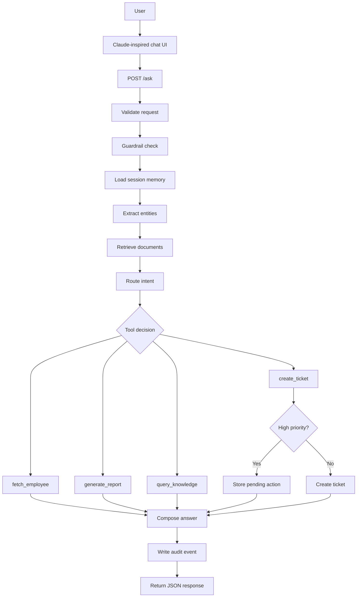
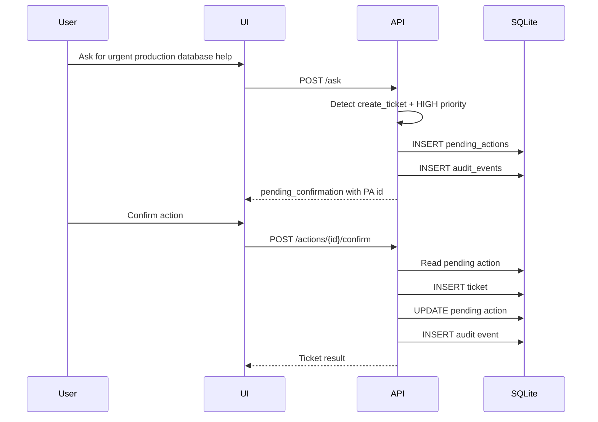
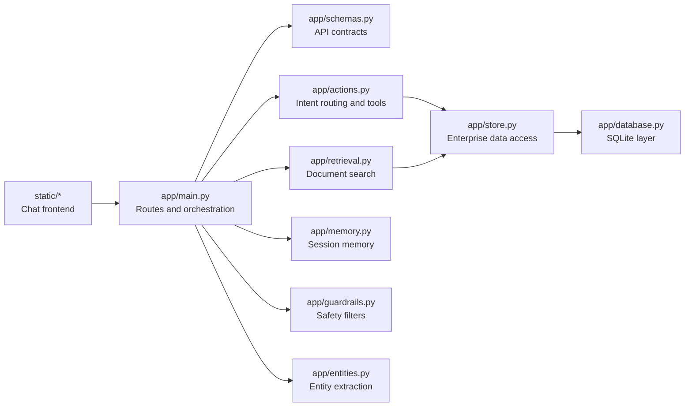
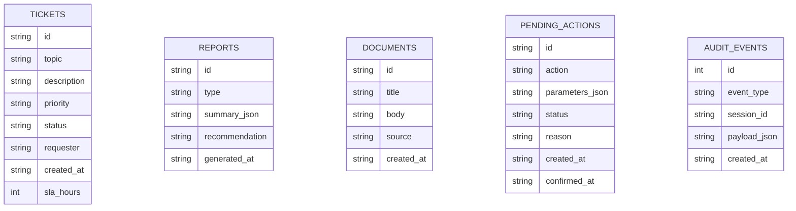
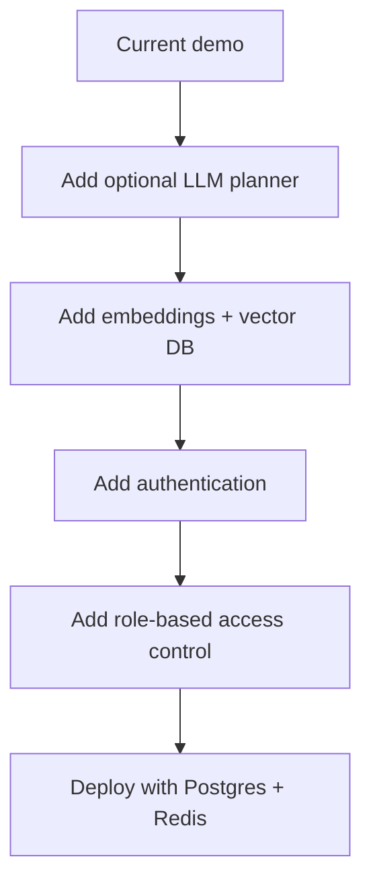

# Architecture

## System Goal

The project is an end-to-end enterprise assistant. It combines a chat UI, FastAPI backend, deterministic agent-style routing, lightweight retrieval, approval-gated actions, SQLite persistence, and audit logging.

## Runtime Flow

## Confirmation Workflow

## Package Layout

## Persistence Model

## Key Design Decisions

- **Deterministic routing instead of mandatory hosted LLM:** Keeps the demo reliable and free to run.
- **SQLite over in-memory state:** Demonstrates production direction without requiring a separate database service.
- **Approval before high-priority ticket execution:** Shows enterprise control and risk management.
- **Document ingestion as JSON:** Avoids extra parser dependencies while still demonstrating RAG-style retrieval.
- **In-memory conversation memory:** Good for demo speed; Redis would be the production replacement.

## Upgrade Path

