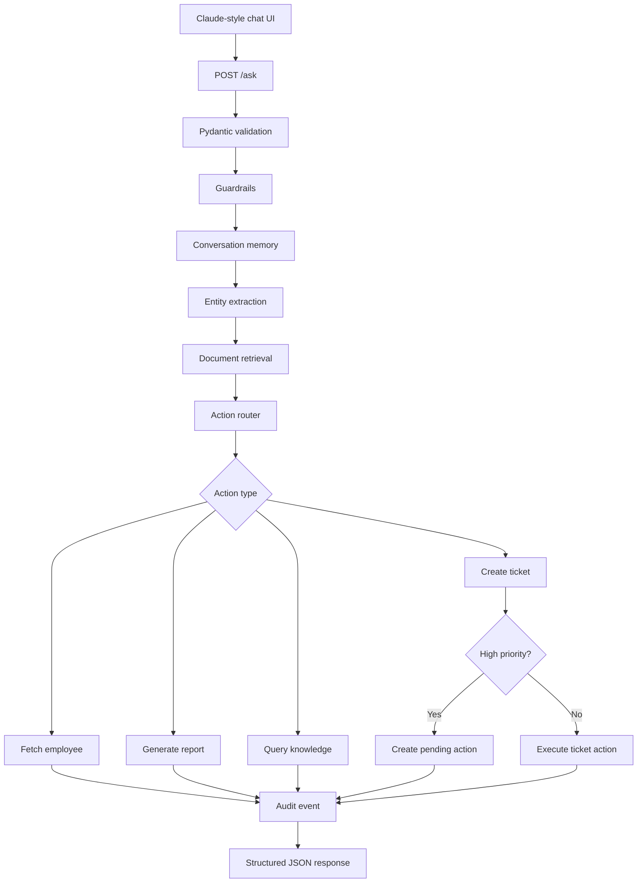
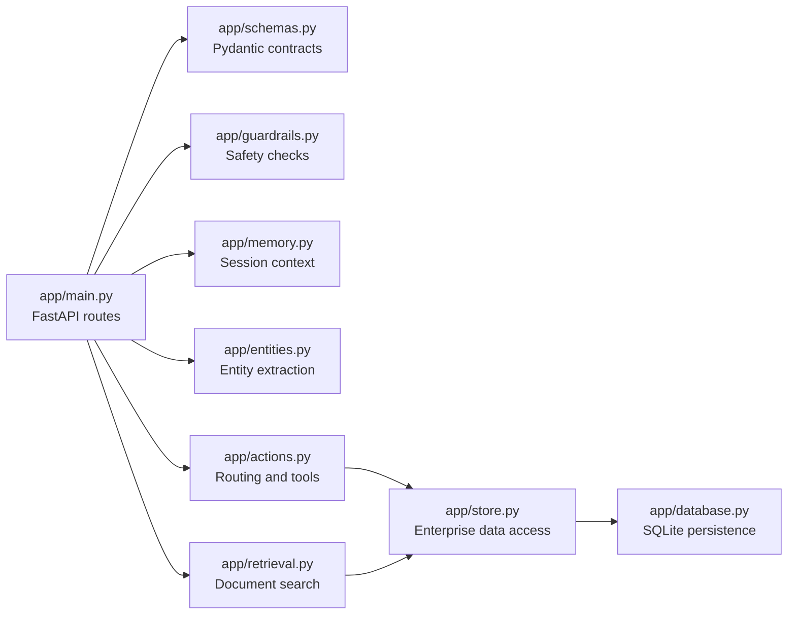

# Enterprise AI Assistant

A FastAPI-based enterprise assistant that answers business questions, retrieves internal knowledge, remembers session context, and performs operational actions through a structured API. It includes a Claude-inspired chat UI and a local SQLite persistence layer, so tickets, reports, documents, pending actions, and audit events survive server restarts.

## What It Does

- Accepts natural-language questions at `POST /ask`
- Fetches employee information from a mock company directory
- Creates support tickets through an approval-aware workflow
- Generates operations reports from persisted ticket/document data
- Retrieves relevant internal documents using lightweight RAG-style search
- Lets users add new knowledge documents through the UI or API
- Stores tickets, reports, documents, pending actions, and audit logs in SQLite
- Tracks session memory for follow-up questions
- Applies request validation and basic enterprise guardrails

## Architecture



## Code Organization



## Run Locally

Install dependencies:

```bash
pip install -r requirements.txt
```

Start the app:

```bash
python -m uvicorn app.main:app --host 0.0.0.0 --port 8001 --reload
```

Or on PowerShell:

```powershell
.\run.ps1
```

Open:

- Chat UI: `http://localhost:8001`
- API docs: `http://localhost:8001/docs`
- Health check: `http://localhost:8001/health`

Run the smoke test:

```bash
python test_assistant.py
```

## Main API

### Ask The Assistant

`POST /ask`

```json
{
  "question": "Can you find information about employee EMP001?",
  "session_id": "optional-session-id",
  "enable_actions": true
}
```

Example response:

```json
{
  "answer": "I found EMP001: Asha Mehta is a Platform Lead in Engineering...",
  "session_id": "session-id",
  "action_performed": "fetch_employee",
  "action_result": {
    "found": true
  },
  "retrieved_context": ["Employee Onboarding SLA"],
  "memory_used": false,
  "latency_ms": 12.5,
  "query_type": "action_required",
  "tokens_used": 15,
  "cached": false,
  "pending_confirmation": null
}
```

### Confirm A Pending Action

High-priority ticket requests are staged first.

`POST /actions/{pending_action_id}/confirm`

```json
{
  "pending_action_id": "PA-ABC123",
  "action_performed": "create_ticket",
  "action_result": {
    "id": "TICKET-1001",
    "priority": "HIGH"
  },
  "status": "CONFIRMED"
}
```

### Add Knowledge

`POST /documents`

```json
{
  "title": "VPN Access Policy",
  "body": "VPN access requests require manager approval and IT fulfillment within one business day.",
  "source": "manual"
}
```

Other useful endpoints:

- `GET /documents`
- `GET /tickets`
- `GET /reports`
- `GET /audit`
- `GET /sessions/{session_id}/history`

## Demo Inputs

Normal business query:

```json
{
  "question": "Can you find information about employee EMP001?"
}
```

Conversation memory:

```json
{
  "question": "What department do they work in?",
  "session_id": "<session_id from previous response>"
}
```

Document retrieval:

```json
{
  "question": "What is the production incident workflow?",
  "enable_actions": false
}
```

High-priority action requiring confirmation:

```json
{
  "question": "I have an urgent issue with the production database. Can you help?"
}
```

## Engineering Improvements

This is deeper than a basic request-response chatbot:

1. **Conversation memory** remembers entities across turns.
2. **Retrieval** searches persisted internal documents.
3. **Tool calling** routes requests to employee lookup, ticketing, reporting, or knowledge search.
4. **Approval workflow** stages high-risk actions before execution.
5. **SQLite persistence** stores operational records.
6. **Audit logging** records completed asks, documents, reports, tickets, and confirmations.
7. **Guardrails** reject unsafe or restricted requests.

## Video Pitch

This project is a lightweight enterprise AI operations assistant. A user can ask a business question in natural language, and the system validates the request, checks guardrails, uses memory for follow-up context, retrieves relevant internal knowledge, routes the request to a business tool, and returns a structured response. It supports realistic actions like employee lookup, support-ticket creation, report generation, document retrieval, approval-gated high-priority actions, and audit logging. The backend is modular FastAPI with SQLite persistence, and the frontend is a Claude-inspired chat workspace designed for a clean enterprise demo.
